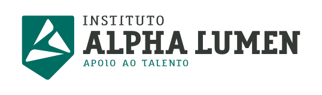

<!--
*** Thanks for checking out the Best-README-Template. If you have a suggestion
*** that would make this better, please fork the repo and create a pull request
*** or simply open an issue with the tag "enhancement".
*** Thanks again! Now go create something AMAZING! :D
***
***
***
*** To avoid retyping too much info. Do a search and replace for the following:
*** github_username, repo_name, twitter_handle, email, project_title, project_description
-->

<!-- PROJECT SHIELDS -->
<!--
*** I'm using markdown "reference style" links for readability.
*** Reference links are enclosed in brackets [ ] instead of parentheses ( ).
*** See the bottom of this document for the declaration of the reference variables
*** for contributors-url, forks-url, etc. This is an optional, concise syntax you may use.
*** https://www.markdownguide.org/basic-syntax/#reference-style-links
-->
[![Commits/semana][commits-shield]][commits-url]
![Linguagens][linguagens-shield]
![Visualizações][visualizacoes-shield]
![Estrelas][estrelas-shield]
[![Seguidores][seguidores-shield]][seguidores-url]
[![LinkedIn][linkedin-shield]][linkedin-url]

<!-- LOGO DO PROJETO -->
 

  

  <h3 align="center">Trilha Web</h3>

  

    Você está prestes a se sentir como um tipo de entidade superior... Obervando aqui cada passo do meu aprendizado front-end. Tudo que for desenvolvido como resolução dos desafios virá pra cá. Boa leitura!
     
    <a href="https://github.com/corqueeuvia/trilha-web-alpha-edtech"><strong>Documentação »</strong></a>
     
     
    <a href="https://github.com/corqueeuvia/trilha-web-alpha-edtech">Demo</a>
    ·
    <a href="https://github.com/corqueeuvia/trilha-web-alpha-edtech/issues">Reporte um bug</a>
  

<!-- SUMÁRIO -->

  
<h2 style="display: inline-block">O que tem aqui</h2>

  <ol>
    <li>
      <a href="#sobre-a-trilha-web">Sobre a trilha web</a>
      <ul>
        <li><a href="#feito-com">Feito com</a></li>
      </ul>
    </li>
    <li><a href="#licença">Licença</a></li>
    <li><a href="#contato">Contato</a></li>
    <li><a href="#agradecimentos">Agradecimentos</a></li>
  </ol>

<!-- ABOUT THE PROJECT -->
## Sobre a trilha web

![![Projeto Alpha EdTech][logo-alpha-edtech]][alpha-edtech]

A tal da "trilha web" é o caminho de aprendizagem que o projeto ![Alpha EdTech][alpha-edtech] do Instituto Alpha Lumen propõe a quem encara o desafio de ser Aspirante. Eu sou Aspirante a desenvolvedor da turma Lovelace, a segunda turma do Alpha EdTech, e criei este repositório para praticar meus aprendizados de Git e GitHub e também para expor meus resultados no front-end. Por aqui vou poder (e você também!) acompanhar meu desenvolvimento, começando pelo front, nessa jornada para me tornar um Desenvolvedor Full-Stack. Bora lá! 

### Feito com

* [VS Code](https://code.visualstudio.com/)
* [Git Bash](https://gitforwindows.org/)
* [GitHub](https://github.com/)

<!-- LICENSE -->
## Licença

Distributed under the MIT License. See `LICENSE` for more information.

<!-- CONTACT -->
## Contato

Caique C. O. Corcovia - [in/corcoviacaique](https://linkedin.com/in/corcoviacaique)

Mais projetos no [GitHub](https://github.com/corqueeuvia)

<!-- ACKNOWLEDGEMENTS -->
## Agradecimentos

* Othneil Drew, pelo ![melhor template de README][readme-template].
* ![Projeto Alpha EdTech][alpha-edtech], pela oportunidade.
* ![EducaTransforma][educa-transforma], pelo curso de Linux que facilitou as aulas de Git.

<!-- MARKDOWN LINKS & IMAGES -->
<!-- https://www.markdownguide.org/basic-syntax/#reference-style-links -->
[commits-shield]: https://img.shields.io/github/commit-activity/w/corqueeuvia/trilha-web-alpha-edtech?style=for-the-badge
[commits-url]: https://github.com/corqueeuvia/trilha-web-alpha-edtech/graphs/commit-activity
[linguagens-shield]: https://img.shields.io/github/languages/top/corqueeuvia/trilha-web-alpha-edtech?style=for-the-badge
[visualizacoes-shield]: https://img.shields.io/github/watchers/corqueeuvia/trilha-web-alpha-edtech?style=for-the-badge
[estrelas-shield]: https://img.shields.io/github/stars/corqueeuvia/trilha-web-alpha-edtech?style=for-the-badge
[seguidores-shield]: https://img.shields.io/github/followers/corqueeuvia?style=for-the-badge
[seguidores-url]: https://github.com/corqueeuvia?tab=followers
[linkedin-shield]: https://img.shields.io/badge/-LinkedIn-black.svg?style=for-the-badge&logo=linkedin&colorB=555
[linkedin-url]: https://linkedin.com/in/corcoviacaique
[alpha-edtech]: https://sejaalphaedtech.org.br/
[readme-template]: https://github.com/othneildrew/Best-README-Template
[educa-transforma]: https://educatransforma.com.br/
[logo-alpha-edtech]: imagens/logo-alpha-edtech.png